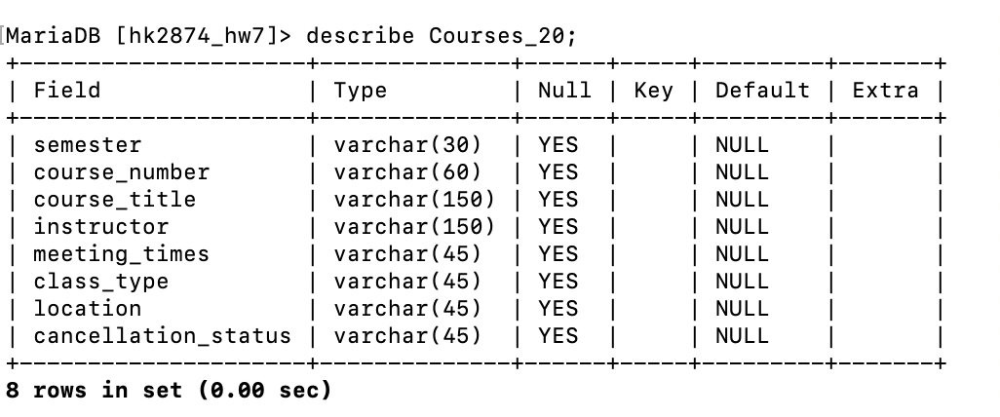
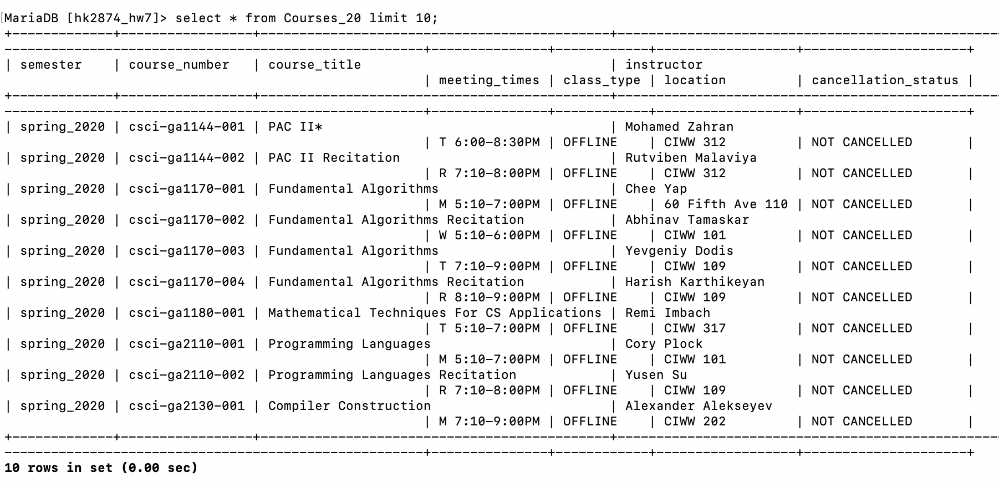
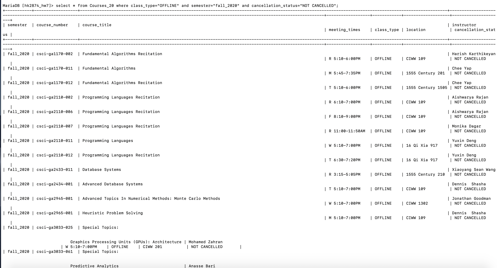
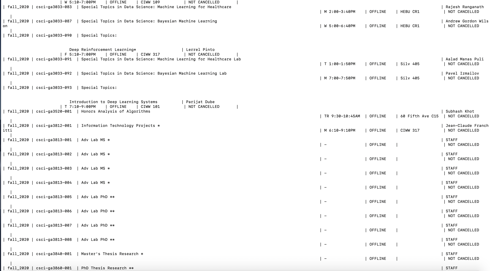
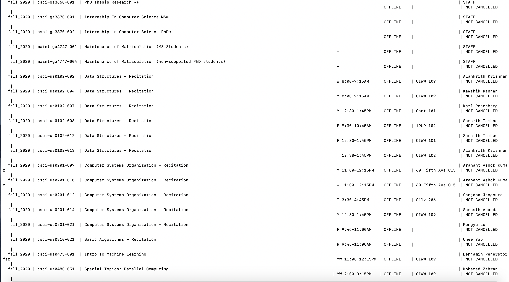
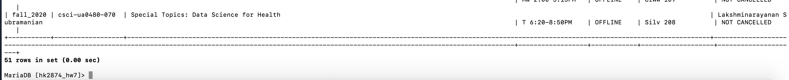
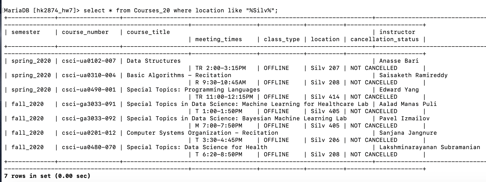

# Homework 07

## Part 1 Queries
1. Connect to your database with a commandline client<br/>
``` mysql -h warehouse.cims.nyu.edu -u hk2874 hk2874_hw7  -p```


2. Write four queries to verify your data load<br/>
DESCRIBE your table(s)<br/>
```describe Courses_20;```<br/><br/>

    

SHOW the first few rows<br/>
```select * from Courses_20 limit 10;```<br/><br/>



WRITE any query #1: show all courses in fall2020 where the course was not online and not cancelled. <br/>
```select * from Courses_20 where class_type="OFFLINE" and semester="fall_2020" and cancellation_status="NOT CANCELLED";```<br/><br/>






Write any query #2: Show all courses in 2020 where it took place in the silver center <br/>
```select * from Courses_20 where location like "%Silv%";```<br/><br/>


## Part 2 Using an API

### Link to API documentation-1
https://www.ipify.org/

### Request Method and Paths of API URLs Used
For ip4, url= 'https://api.ipify.org?format=json'
However, according to the site, from Oct 1, 2020 the A record for api6.ipify.org will be removed to make the subdomain only for IPv6 requests. For universal access please use api64.ipify.org.
Thus, the path of api url used for this assignment='https://api64.ipify.org?format=json'

### Example Format of Response
Response format: JSON 
Sample Output (IPv4/IPv6)
{"ip":"98.207.254.136"} or {"ip":"2a00:1450:400f:80d::200e"}

### Authentication Requirements
This does not require authentication

### Optional Additional Documentation (such as using a pre-built client)

### Link to API documentation-2
https://github.com/M-Media-Group/Covid-19-API

### Request Method and Paths of API URLs Used
Request:GET /cases and uses live cases data
url='https://covid-api.mmediagroup.fr/v1/cases?country='

### Example Format of Response
Response format: JSON 
Sample Output for France (GET /cases?country=France)
{"All": {"confirmed": 2087466, "recovered": 148727, "deaths": 46351, "country": "France", "population": 64979548, "sq_km_area": 551500, "life_expectancy": "78.8", "elevation_in_meters": 375, "continent": "Europe", "abbreviation": "FR", "location": "Western Europe", "iso": 250, "capital_city": "Paris", "lat": "46.2276", "long": "2.2137", "updated": "2020/11/18 17:25:18+00"}, "French Guiana": {"lat": "4", "long": "-53", "confirmed": 10900, "recovered": 9995, "deaths": 70, "updated": "2020/11/18 17:25:18+00"}, "French Polynesia": {"lat": "-17.6797", "long": "-149.4068", "confirmed": 12362, "recovered": 4842, "deaths": 61, "updated": "2020/11/18 17:25:18+00"}, "Guadeloupe": {"lat": "16.265", "long": "-61.551", "confirmed": 8225, "recovered": 2242, "deaths": 143, "updated": "2020/11/18 17:25:18+00"}, "Martinique": {"lat": "14.6415", "long": "-61.0242", "confirmed": 4732, "recovered": 98, "deaths": 37, "updated": "2020/11/18 17:25:18+00"}, "Mayotte": {"lat": "-12.8275", "long": "45.166244", "confirmed": 5036, "recovered": 2964, "deaths": 48, "updated": "2020/11/18 17:25:18+00"}, "New Caledonia": {"lat": "-20.904305", "long": "165.618042", "confirmed": 30, "recovered": 29, "deaths": 0, "updated": "2020/11/18 17:25:18+00"}, "Reunion": {"lat": "-21.1151", "long": "55.5364", "confirmed": 7298, "recovered": 5928, "deaths": 34, "updated": "2020/11/18 17:25:18+00"}, "Saint Barthelemy": {"lat": "17.9", "long": "-62.8333", "confirmed": 127, "recovered": 94, "deaths": 0, "updated": "2020/11/18 17:25:18+00"}, "Saint Pierre and Miquelon": {"lat": "46.8852", "long": "-56.3159", "confirmed": 16, "recovered": 12, "deaths": 0, "updated": "2020/11/18 17:25:18+00"}, "St Martin": {"lat": "18.0708", "long": "-63.0501", "confirmed": 690, "recovered": 598, "deaths": 12, "updated": "2020/11/18 17:25:18+00"}}

### Authentication Requirements
No authorisation is required to fetch data from the API.

### Optional Additional Documentation (such as using a pre-built client)